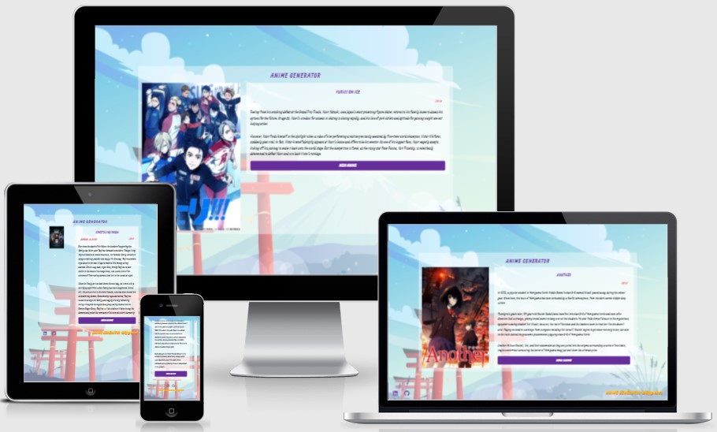

# Anime Generator

This is taken inspiration from my Random Quote Machine project that I did for the freeCodeCamp Front End Development Libraries Project.  

I wanted to develop a site where you could randomly have an Anime picked out for you, especially if you are stuck on what anime to watch next! I wanted to make it easily accessible for on the go or when the user would like to discover a new anime that they have not seen yet!

This has over 100 Animes that are counted to be the most popular Anime's to this date that you should have watched by now!

## Showcase

 

A deployed version of my website can be found [here](https://elliej87.github.io/AnimeGenerator/)

This domain will allow you to access the Anime Generator website.

## Table of Contents

1. [User Experience UX](#userexperienceuX)

    * [User Stories](#userstories)

        - [An Anime Fan](#animefan)
        - [New Anime Fan](#newanime)
        - [All Users](#allusers)
        - [Site Owner Goals](#sitegoals)

2. [Wireframes](#wireframesboards)

3. [Features](#featuressite)

    * [Main Container](#maincontainer)
    * [Footer](#footerfeatures)

4. [Technologies Used](#technologies)

    * [Version Control](#versioncontrol)

5. [Functionality Testing](#functionalitytesting)
  
    - [Footer Social Navigation Links](#footerlinks)
      * [LinkedIn Icon](#linkedinicon)
      * [GitHub Icon](#githubicon)
  
    - [Container](#container)
      * [Container](#container)
      * [Text & Option Containers](#textcontainers)

6. [Responsive Design Testing](#responsivedesigntesting)

7. [Validation](#validationcode)
    - [HTML](#htmlcode)
    - [CSS](#csscode) 

8. [Bugs](#bugsfixes)

9. [Deployment](#deploymentsite)

    * [Repository Link](#repositorylink)
    * [Running Code Locally](#runningcodelocally)

10. [Credits](#finalcredits)

    * [Content](#contentsite)
    * [Acknowledgments](#acknowledgmentsthanks)

## <a name="userexperienceuX">UX (User Experience)</a>

This website is for anyone who wants to find a new Anime that they may or may not have seen before or they are new to Anime and want to start watching it, this site has taken over 100 Animes that are deemed ones you should have watch or are just generally too good not to watch.Features links to my social media sites where they can interact with me directly.

## <a name="userstories">User Stories</a>

### <a name="animefan">An Anime Fan</a>

- I want to be able to have ease accessed to a new Anime that I might not have seen before
- I want to be able to click the button to change the Anime incase I have already seen it

### <a name="newanime">New Anime Fan</a>

- I want to experience a new Anime title and to have a clear understanding of the Anime thruogh the image, title and synopsis

### <a name="allusers">All Users</a>

- I want to have the romaji title (kanji pronunciation) displayed (this is the Japanese title but not in Kanji)
- I want to have the english title visible 
- I want to know the year it was released
- I want to have an image of the title so I can get a feel of the Anime
- I want to have the synopsis of the Anime so I can get an understanding on what the anime is about 
- I want the button to be visible so I can easily change the anime title
- I want the site to be easy navigable on both desktop and on mobile so I can pick this up where and when I can
- I want to be able to see and interact with them via social media

### <a name="sitegoals">Site Owner Goals</a>

- As a site owner I want to ensure the user generates a new Anime title each time the button is clicked

## <a name="wireframesboards">Wireframes</a>

The wireframes were created using [Adobe XD](https://www.adobe.com/uk/products/xd.html) and the imagery can be found in the wireframes in pdf format. 

Desktop & Laptop | Tablet & Mobile
------------------------ | ---------------------
[Home](https://github.com/EllieJ87/MindfulnessMeditation/blob/master/images/home-desktop.png) | [Home](https://github.com/EllieJ87/MindfulnessMeditation/blob/master/images/home-mobile.png)

There are some differences between my wireframes and my final website. 

I decided to add a footer so users could interact with me or check out my other works in the social media links. 

## <a name="featuressite">Features</a>

This section is a brief highlight of features that this site contains.

### <a name="maincontainer">Main Container</a>

- This is vertially and horizontally central on the main view width
- This contains an image, Anime title, English title, year and synopsis that generates a new Anime when the button is clicked
- Button to generate new Anime at random

### <a name="footerfeatures">Footer</a>

- Contains the copyright text, this is on the right side of the page which is then centred and on the bottom of the social media links on smaller screens for easy readability.
- Contains the ‘LinkedIn’ and ‘GitHub’ navigation links on the left side of the page and evenly spaced these are then stacked ontop of the copyright text, these are centred to the width of the screen
- All navigation links have an animation and a colour change when the user hover over the icon, this is so the user knows they are interactive and have a purpose
- The ‘LinkedIn’ and ‘GitHub’ icons opens a new window to the relevant page 
- The footer runs along and is fixed at the bottom with no fill colour to make this easy to read and visual appealing

## <a name="technologies">Technologies Used</a>

[Adobe XD](https://www.adobe.com/uk/products/xd.html) 

-	I've used Adobe XD to create wireframes of my website before building the actual site.

[Bootstrap](https://getbootstrap.com)

-	The project uses the Bootstrap framework to add a responsive grid system, prebuilt components, plugins built on jQuery, and Bootstrap styles to my game, before adding my own custom styling 

[CSS](https://en.wikipedia.org/wiki/CSS)

-	The project uses CSS to apply the custom styles to create the look of my game.  The index.html file is linked directly to the main.css stylesheet

[Font Awesome](https://fontawesome.com/v4.7/) 

-	The project uses Font Awesome icons for all navigation and social media links that feature in the header and footer of my site

Google Chrome Dev Tools

-	For testing purposes for responsive design

[Google Fonts](https://fonts.google.com)

-	Google fonts was used to import ‘Orbiton font and ‘Sarpanch’ into the HTML which is used on all pages throughout the project.

[HTML5](https://en.wikipedia.org/wiki/HTML5)

-	The project uses HTML to create the basic elements and content of my game 

[JavaScript](https://en.wikipedia.org/wiki/JavaScript)

-	The project uses JavaScript from my custom script.js file to add functionality and interactivity to my text adventure game.  This is the core focus of this project.  The project also uses JavaScript from Bootstrap which is required to add functionality to the Bootstrap modal 

[jQuery](https://en.wikipedia.org/wiki/JQuery)

-	The project uses jQuery to simplify DOM manipulation. This is both the standard jQuery that is built with Bootstrap components, and my custom jQuery used in my index.html and script.js files

[Visual Studio Code](https://code.visualstudio.com)

-	I used Visual Studio Code as the development environment to write the code for my website

### <a name="versioncontrol">Version Control</a>

[Git](https://git-scm.com)

-	I've used Git as a version control system to regularly add and commit changes made to project in Visual Studio Code, before pushing them to GitHub.

[GitHub](https://github.com)

-	I've used GitHub as a remote repository to push and store the committed changes to my project from Git. I've also used GitHub pages to deploy my website in a live environment.

## <a name="testingcases">Testing</a>

# <a name="functionalitytesting">Functionality Testing</a>

Browsers tested: Google Chrome, Mozilla Firefox & Opera.
The devices used in this testing include Samsung S10 v.Android 10.

## <a name="footerlinks">Footer Social Navigation Links</a>

### <a name="linkedinicon">LinkedIn Icon</a>

Expected: when hovering over 'LinkedIn' icon, the icon changes colour
Testing: tested by hovering over item
Result: icon changes colour

Expected: when clicking on the ‘LinkedIn’ icon takes the user to my LinkedIn page
Testing: tested by clicking on the ‘LinkedIn’ icon
Results: link takes user to [LinkedIn](https://www.linkedin.com/in/ellie-judge-45b00689/)
 
### <a name="githubicon">GitHub Icon</a>

Expected: when hovering over 'GitHub' icon, the icon changes colour
Testing: tested by hovering over item
Result: icon changes colour

Expected: when clicking on the ‘GitHub’ icon takes the user to my GitHub repo page
Testing: tested by clicking on the ‘GitHub’ icon
Results: link takes user to [GitHub](https://github.com/EllieJ87)

## <a name="container">Container</a>

Expected: the Anime title to change when the button is clicked
Testing: click on the button to generate a new Anime title
Results: Anime title is changed when the button is clicked

Expected: the English Anime title to change when the button is clicked
Testing: click on the button to generate a the English Anime title
Results: English Anime title is changed when the button is clicked

Expected: the year to change when the button is clicked
Testing: click on the button to generate a the year when the Anime was released
Results: year is changed when the button is clicked

Expected: the image to change when the button is clicked
Testing: click on the button to generate a the image of the chosen Anime
Results: image is changed when the button is clicked

Expected: button to generate a new Anime when this is clicked
Testing: click on the button
Results: button changes the Anime that is randomly generated

### Responsiveness

Expected: to be displayed and re-sized across different screen sizes and width
Testing: re-layout the smaller screen and landscape screen for more visual readability and to make the most of the available space
Results: multiple testing and layout plans to achieve the look
 
### <a name="responsivedesigntesting">Responsive Design Testing</a>

I used Google Chrome's Development tools to constantly test each change that I made to my website and to ensure that it appeared in the desired way on different screen sizes. I also tested my website on different screen sizes (mobile, tablet and desktop) to ensure it appeared in the desired way on different devices.

I used my own phone to test the orientation and how the site differs from portrait to landscape and to get a feel on the user experience.

## <a name="validationcode">Validation</a>

### <a name="htmlcode">HTML</a>

W3C testing completed for: index.html
No issues were stated.
 
## <a name="csscode">CSS</a>

W3C testing completed for: styles.css
No issues were stated.

## <a name="bugsfixes">Bugs</a>

**Font Awesome**
- Issue: Was not displaying the icons, was showing a square box display rather than the icon itself, these were also not re-directing to the desired linked site
- Testing:  
  1. Tested various CDN links to see if this displayed the icons - did not work
  2. Downloaded the Font Awesome css library to see if this displayed the icons - still was not showing the icons
  3. Tested removing of links, removing my own style sheet displayed the images; from this:
    - Removed different elements from the styling to see if the icons were displaying,
    - Removed the ::before and ::after elements and this showed the icons correctly

- Results: Displaying and correctly re-directing the user to the appropirate site

- Personal Note: I will research more into the ::before and ::after psuedo elements and see why this could be affecting the font awesome icons

**Font Awesome**
- Issue: background image was being cut off at the bottom on smaller screens / when 'new anime' button was clicked this push all the information towards the top of the screen and cut off all the information
- Testing:  
  1. Tested various main body sizing and container sizing 
  2. Added overflow properties from smaller screen / landscape sizes so user was able to scroll down the information
  3. Overflow scroll was removed on the larger screen sizes as this displayed all the information without scrolling

- Results: Displaying background image to fit the height of the screen size and correctly scrolling down the content on smaller screen size.

## <a name="deploymentsite">Deployment</a>

The hosting platform that I've used for my project is GitHub Pages. To deploy my website to GitHub pages, I used the following steps:

-	Loaded the terminal window in my visual studio code workspace
-	Initialised Git using the Source Control in the control panel
-	Files that have been amended are automatically listed in the ‘Source Control’ panel
-	Add message in the ‘Message’ section, making sure the commits are clear and concise (re-checked previous commits for layout and what was fixed / still pending)
-	Click the ‘tick’ icon which stored the files in visual studio code
-	Click the ‘ellipsis’ icon and select the ‘push’ option
-	This then push all files and commits to the main branch
-	This will add the updated files into the ‘main branch’ option under the ‘GitHub pages’ section
-	Ran several commits after testing was carried out throughout my project.

### <a name="repositorylink">Repository Link</a>

[Anime Generator](https://elliej87.github.io/AnimeGenerator/)

### <a name="runningcodelocally">Running Code Locally</a>

To run my code locally, users can download a local copy of my code to their desktop by completing the following steps:

-	Go to my GitHub repository.
-	Click on 'Clone or download'.
-	Click on 'Download ZIP'.
-	Once downloaded, extract the zip file's contents and run my website locally.

## <a name="contentsite">Content</a>

This website was a quick and fun site for me to practice more web development skills and styling .

## <a name="acknowledgmentsthanks">Acknowledgments</a>

_**Created by Ellie Judge**_